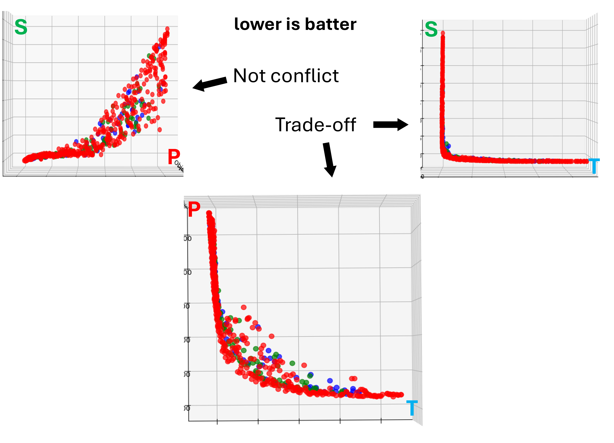
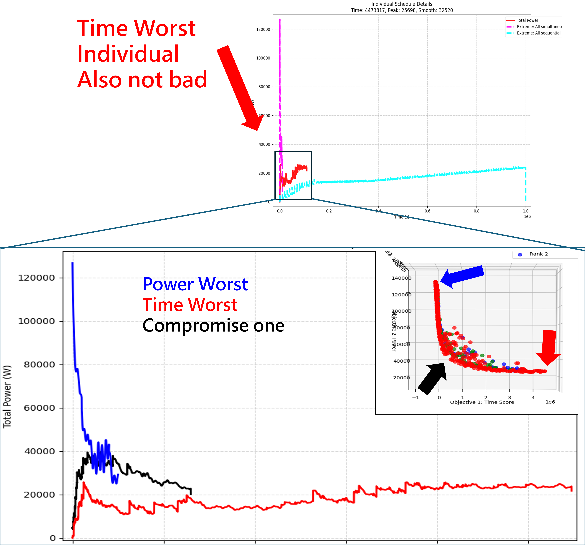

# Multi-Objective Dynamic Startup Scheduling Technique Based on Improved NSGA-II

> **An Intelligent Industrial Load Smoothing & Energy Optimization Framework**  
> 本專案實作基於改進型非支配排序遺傳演算法 II（Improved NSGA-II）之異質機台啟動排程優化系統。結合創新的「Shake」演算法與動態連續模擬電力積分，解決工業環境中機台同時啟動引發的瞬間峰值負載（Peak Load）問題，達成**高效率、低峰值、穩定平滑**的啟動排程優化。

---

## 📌 Project Highlights & Contributions

- **解決超高維度暴力搜尋瓶頸**：針對龐大的組合優化解空間（在 100 台機台、Step=10 的設定下，解空間高達 $O(100^{100})$，遠超可觀測宇宙的原子總數 $10^{80}$），成功利用遺傳演算法搜尋出 Pareto 最適解。
- **創新 "Shake" 突變機制**：在交叉與變異流程中導入特殊的 Shake 操作，有效跳脫局部最佳解（Local Optima），保持種群多樣性。
- **動態連續模擬電力整合**：實作連續性的 Power Consumption Integration，能精準反映機台啟動過程中的動態功率變化。
- **多目標 Pareto Trade-off**：同時針對**峰值功率**、**總完成時間**與**功率平滑度**進行三目標優化。

---

## 📐 Mathematical Model & Fitness Functions

本系統定義染色體（Chromosome）為各機台的啟動延遲時間（Startup Delay Time）：
$$\text{Chromosome} = [\text{Gene}_1, \text{Gene}_2, \dots, \text{Gene}_N]$$


針對排程優化，系統評估以下三個適應度函數（Fitness Functions，皆為越低越佳）：

1. **峰值功率 (Peak Power, $f_p$)**:
   $$f_p = \max(\text{Power at any time})$$

   *目的：降低瞬間最大用電負載，避免超過電網契約容量。*

2. **總完成時間 (Finish Time, $f_T$)**:
   $$f_T = \sum(\text{genes}) + 10 \times \max(\text{genes})$$

   *目的：縮短整體作業排程，降低等待時程。*

3. **功率平滑度 (Power Smoothness, $f_s$)**:
   $$f_s = \text{Avg}((P_t - P_{t-1})^2)$$

   *目的：極小化前後時間點的功率波動度（Variance），達成穩定供電。*

---

## 🔄 Evolutionary Algorithm Architecture

優化流程包含標準 GA 演算法之改進版：

```text
[Start]
   │
[Population Initialization]
   │
[Crossover] ─── (Cut / Arithmetic)
   │
[Mutation]  ─── (Cut and Shift / Place / Shake) 👈 Novel Enhancement
   │
[Fitness Evaluation (f_p, f_T, f_s)]
   │
[Termination Check?] ──(No)──► [Evolve & Select]
   │ (Yes)
   ▼
[Output Pareto Population]

---

## 📊 Experimental Results

在測試範例（Generations: 500, Group/Population: 400, Gene Size: 100）中，系統展現出優異的多目標 Pareto 搜尋能力：

### 1. 3D Pareto Front (S-P-T View)
3D Pareto 圖（Smoothness-Power-Time）展示了三個目標之間的 Trade-off 關係：
* **Time Worst Individual**: 完成時間最長，但換取了較低的 Peak 負載。
* **Power Worst Individual**: 峰值最高，但整體排程最快[cite: 1]。
* **Compromise Solution (Best Trade-off)**: 在時間與峰值之間取得最佳平衡點[cite: 1]。



### 2. Total Power Profile Comparison (W)
對比優化前後的用電負載曲線，成功將瞬間 Peak 壓降，並平滑化電力需求[cite: 1]：



---

## 📂 Repository Structure

```text
├── code/                   # 核心程式碼與演算法實作
│   ├── Pareto_ga.py        # Improved NSGA-II 核心與 Shake 演算法
│   ├── power.py            # 模擬功耗及預先算功耗
│   └── viewer.py           # 3D Pareto 前沿與顯示單個體
├── docs/                   # 海報與實驗圖檔
├── main.py                 # 主程式進入點
├── requirements.txt        # 依賴套件清單
└── README.md
---